```dot
digraph NLP_Chapter {
    node [shape=box];

    // Sections
    Regular_Expressions [label="Regular Expressions"];
    Text_Normalization [label="Text Normalization"];
    Edit_Distance [label="Edit Distance"];

    // Concepts within Regular Expressions
    Regular_Expression [label="Regular Expression"];
    Concatenation [label="Concatenation"];
    Square_Brackets [label="Square Brackets"];
    Question_Mark [label="Question Mark"];
    Kleene_Star [label="Kleene Star"];
    Kleene_Plus [label="Kleene Plus"];
    Period [label="Period"];
    Anchors [label="Anchors"];
    Disjunction [label="Disjunction"];
    Parenthesis [label="Parenthesis"];
    Precedence [label="Precedence"];
    Greedy_Matching [label="Greedy Matching"];
    Non_Greedy_Matching [label="Non-Greedy Matching"];
    Word_Boundary [label="Word Boundary"];
    Substitution [label="Substitution"];
    Capture_Group [label="Capture Group"];
    Lookahead_Assertion [label="Lookahead Assertion"];

    // Concepts within Text Normalization
    Text_Normalization_Concept [label="Text Normalization"];
    Tokenization [label="Tokenization"];
    Lemmatization [label="Lemmatization"];
    Stemming [label="Stemming"];
    Sentence_Segmentation [label="Sentence Segmentation"];

    // Concepts within Edit Distance
    Edit_Distance_Concept [label="Edit Distance"];
    Minimum_Edit_Distance_Algorithm [label="Minimum Edit Distance Algorithm"];

    // Section relationships
    Regular_Expressions -> Text_Normalization;
    Text_Normalization -> Edit_Distance;

    // Regular Expressions prerequisites
    Regular_Expression -> Concatenation;
    Regular_Expression -> Square_Brackets;
    Square_Brackets -> Question_Mark;
    Regular_Expression -> Kleene_Star;
    Kleene_Star -> Kleene_Plus;
    Regular_Expression -> Period;
    Regular_Expression -> Anchors;
    Regular_Expression -> Disjunction;
    Disjunction -> Parenthesis;
    Regular_Expression -> Precedence;
    Precedence -> Greedy_Matching;
    Greedy_Matching -> Non_Greedy_Matching;
    Regular_Expression -> Word_Boundary;
    Regular_Expression -> Substitution;
    Substitution -> Capture_Group;
    Capture_Group -> Lookahead_Assertion;

    // Text Normalization prerequisites
    Text_Normalization_Concept -> Tokenization;
    Tokenization -> Lemmatization;
    Lemmatization -> Stemming;
    Text_Normalization_Concept -> Sentence_Segmentation;

    // Edit Distance prerequisites
    Edit_Distance_Concept -> Minimum_Edit_Distance_Algorithm;

    // Grouping concepts into sections
    subgraph cluster_Regular_Expressions {
        label = "Regular Expressions";
        Regular_Expression;
        Concatenation;
        Square_Brackets;
        Question_Mark;
        Kleene_Star;
        Kleene_Plus;
        Period;
        Anchors;
        Disjunction;
        Parenthesis;
        Precedence;
        Greedy_Matching;
        Non_Greedy_Matching;
        Word_Boundary;
        Substitution;
        Capture_Group;
        Lookahead_Assertion;
    }

    subgraph cluster_Text_Normalization {
        label = "Text Normalization";
        Text_Normalization_Concept;
        Tokenization;
        Lemmatization;
        Stemming;
        Sentence_Segmentation;
    }

    subgraph cluster_Edit_Distance {
        label = "Edit Distance";
        Edit_Distance_Concept;
        Minimum_Edit_Distance_Algorithm;
    }
}
```

https://chatgpt.com/share/e6801864-c4e2-43f6-8413-92d161191d17

```
You are a teacher and and expert in natural language processing. You wrote a chapter of an NLP textbook and would like to convert the content of the chapter into a classroom lesson. You would like to step into the shoes of a student in order to understand their learning process of this material. You need to understand which concepts are being thought and their relationships. Read the entirety of this document and write a long and detailed summary of what concepts are being taught and their relationships. You are most interested in the following relationships: 
- isConcept(A); A is a concept being taught to the student
- isPrerequisiteOf(A, B); in order to understand the concept B, the student must first understand the concept A

- isSection(S); S is a set of related concepts being taught (i.e. Regular Expressions)
- isPartOf(A, S); concept A is part of the section S
- isPrerequisiteOf(S1, S2); the student needs to understand the content of section S1 in order to proceed to learning about section S2

Again, your very important task is to read the ENTIRETY of the given document and generate a DETAILED summary of the CONCEPTS taught and their RELATIONSHIPS. Read the ENTIRE DOCUMENT.

Output in the form of a prolog program.
```

```prolog
% Sections
isSection(regular_expressions).
isSection(text_normalization).
isSection(edit_distance).

% Concepts within Regular Expressions
isConcept(regular_expression).
isConcept(concatenation).
isConcept(square_brackets).
isConcept(question_mark).
isConcept(kleene_star).
isConcept(kleene_plus).
isConcept(period).
isConcept(anchors).
isConcept(disjunction).
isConcept(parenthesis).
isConcept(precedence).
isConcept(greedy_matching).
isConcept(non_greedy_matching).
isConcept(word_boundary).
isConcept(substitution).
isConcept(capture_group).
isConcept(lookahead_assertion).

isPartOf(regular_expression, regular_expressions).
isPartOf(concatenation, regular_expressions).
isPartOf(square_brackets, regular_expressions).
isPartOf(question_mark, regular_expressions).
isPartOf(kleene_star, regular_expressions).
isPartOf(kleene_plus, regular_expressions).
isPartOf(period, regular_expressions).
isPartOf(anchors, regular_expressions).
isPartOf(disjunction, regular_expressions).
isPartOf(parenthesis, regular_expressions).
isPartOf(precedence, regular_expressions).
isPartOf(greedy_matching, regular_expressions).
isPartOf(non_greedy_matching, regular_expressions).
isPartOf(word_boundary, regular_expressions).
isPartOf(substitution, regular_expressions).
isPartOf(capture_group, regular_expressions).
isPartOf(lookahead_assertion, regular_expressions).

% Concepts within Text Normalization
isConcept(text_normalization).
isConcept(tokenization).
isConcept(lemmatization).
isConcept(stemming).
isConcept(sentence_segmentation).

isPartOf(text_normalization, text_normalization).
isPartOf(tokenization, text_normalization).
isPartOf(lemmatization, text_normalization).
isPartOf(stemming, text_normalization).
isPartOf(sentence_segmentation, text_normalization).

% Concepts within Edit Distance
isConcept(edit_distance).
isConcept(minimum_edit_distance_algorithm).

isPartOf(edit_distance, edit_distance).
isPartOf(minimum_edit_distance_algorithm, edit_distance).

% Prerequisites among concepts in Regular Expressions
isPrerequisiteOf(regular_expression, concatenation).
isPrerequisiteOf(regular_expression, square_brackets).
isPrerequisiteOf(square_brackets, question_mark).
isPrerequisiteOf(regular_expression, kleene_star).
isPrerequisiteOf(kleene_star, kleene_plus).
isPrerequisiteOf(regular_expression, period).
isPrerequisiteOf(regular_expression, anchors).
isPrerequisiteOf(regular_expression, disjunction).
isPrerequisiteOf(disjunction, parenthesis).
isPrerequisiteOf(regular_expression, precedence).
isPrerequisiteOf(precedence, greedy_matching).
isPrerequisiteOf(greedy_matching, non_greedy_matching).
isPrerequisiteOf(regular_expression, word_boundary).
isPrerequisiteOf(regular_expression, substitution).
isPrerequisiteOf(substitution, capture_group).
isPrerequisiteOf(capture_group, lookahead_assertion).

% Prerequisites among concepts in Text Normalization
isPrerequisiteOf(text_normalization, tokenization).
isPrerequisiteOf(tokenization, lemmatization).
isPrerequisiteOf(lemmatization, stemming).
isPrerequisiteOf(text_normalization, sentence_segmentation).

% Prerequisites among concepts in Edit Distance
isPrerequisiteOf(edit_distance, minimum_edit_distance_algorithm).

% Prerequisites among sections
isPrerequisiteOf(regular_expressions, text_normalization).
isPrerequisiteOf(text_normalization, edit_distance).

```

