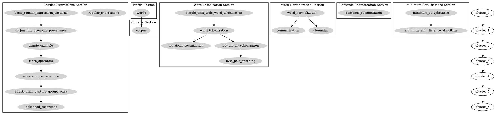

https://chatgpt.com/share/ff620b28-284b-423b-bc8e-065b5b35a20b

```
You are a teacher and and expert in natural language processing. You wrote a chapter of an NLP textbook and would like to convert the content of the chapter into a classroom lesson. You would like to step into the shoes of a student in order to understand their learning process of this material. You need to understand which concepts are being thought and their relationships. Read the entirety of this document and write a long and detailed summary of what concepts are being taught and their relationships. You are most interested in the following relationships: 
- isConcept(A); A is a concept being taught to the student
- isPrerequisiteOf(A, B); in order to understand the concept B, the student must first understand the concept A

- isSection(S); S is a set of related concepts being taught (i.e. Regular Expressions)
- isPartOf(A, S); concept A is part of the section S
- isPrerequisiteOf(S1, S2); the student needs to understand the content of section S1 in order to proceed to learning about section S2

Again, your very important task is to read the ENTIRETY of the given document and generate a DETAILED summary of the CONCEPTS taught and their RELATIONSHIPS. Read the ENTIRE DOCUMENT.

Output in the form of a prolog program.
```

```prolog
% Concepts and Sections
isConcept(regular_expressions).
isConcept(basic_regular_expression_patterns).
isConcept(disjunction_grouping_precedence).
isConcept(simple_example).
isConcept(more_operators).
isConcept(more_complex_example).
isConcept(substitution_capture_groups_eliza).
isConcept(lookahead_assertions).
isConcept(words).
isConcept(corpus).
isConcept(word_tokenization).
isConcept(simple_unix_tools_word_tokenization).
isConcept(top_down_tokenization).
isConcept(bottom_up_tokenization).
isConcept(byte_pair_encoding).
isConcept(word_normalization).
isConcept(lemmatization).
isConcept(stemming).
isConcept(sentence_segmentation).
isConcept(minimum_edit_distance).
isConcept(minimum_edit_distance_algorithm).

isSection(regular_expressions_section).
isSection(words_section).
isSection(corpora_section).
isSection(word_tokenization_section).
isSection(word_normalization_section).
isSection(sentence_segmentation_section).
isSection(minimum_edit_distance_section).

isPartOf(regular_expressions, regular_expressions_section).
isPartOf(basic_regular_expression_patterns, regular_expressions_section).
isPartOf(disjunction_grouping_precedence, regular_expressions_section).
isPartOf(simple_example, regular_expressions_section).
isPartOf(more_operators, regular_expressions_section).
isPartOf(more_complex_example, regular_expressions_section).
isPartOf(substitution_capture_groups_eliza, regular_expressions_section).
isPartOf(lookahead_assertions, regular_expressions_section).

isPartOf(words, words_section).
isPartOf(corpus, corpora_section).
isPartOf(word_tokenization, word_tokenization_section).
isPartOf(simple_unix_tools_word_tokenization, word_tokenization_section).
isPartOf(top_down_tokenization, word_tokenization_section).
isPartOf(bottom_up_tokenization, word_tokenization_section).
isPartOf(byte_pair_encoding, word_tokenization_section).

isPartOf(word_normalization, word_normalization_section).
isPartOf(lemmatization, word_normalization_section).
isPartOf(stemming, word_normalization_section).

isPartOf(sentence_segmentation, sentence_segmentation_section).
isPartOf(minimum_edit_distance, minimum_edit_distance_section).
isPartOf(minimum_edit_distance_algorithm, minimum_edit_distance_section).

% Prerequisite Relationships between Concepts
isPrerequisiteOf(basic_regular_expression_patterns, disjunction_grouping_precedence).
isPrerequisiteOf(disjunction_grouping_precedence, simple_example).
isPrerequisiteOf(simple_example, more_operators).
isPrerequisiteOf(more_operators, more_complex_example).
isPrerequisiteOf(more_complex_example, substitution_capture_groups_eliza).
isPrerequisiteOf(substitution_capture_groups_eliza, lookahead_assertions).

isPrerequisiteOf(words, corpus).

isPrerequisiteOf(simple_unix_tools_word_tokenization, word_tokenization).
isPrerequisiteOf(word_tokenization, top_down_tokenization).
isPrerequisiteOf(word_tokenization, bottom_up_tokenization).
isPrerequisiteOf(bottom_up_tokenization, byte_pair_encoding).

isPrerequisiteOf(word_normalization, lemmatization).
isPrerequisiteOf(word_normalization, stemming).

isPrerequisiteOf(minimum_edit_distance, minimum_edit_distance_algorithm).

% Prerequisite Relationships between Sections
isPrerequisiteOf(regular_expressions_section, words_section).
isPrerequisiteOf(words_section, corpora_section).
isPrerequisiteOf(corpora_section, word_tokenization_section).
isPrerequisiteOf(word_tokenization_section, word_normalization_section).
isPrerequisiteOf(word_normalization_section, sentence_segmentation_section).
isPrerequisiteOf(sentence_segmentation_section, minimum_edit_distance_section).

```

