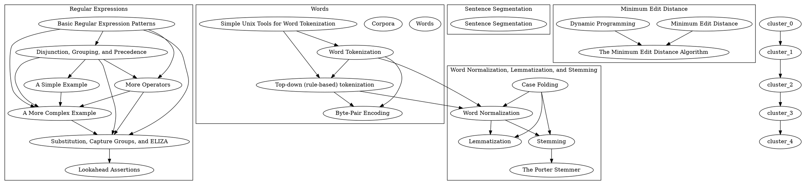

https://chatgpt.com/share/908d67ba-2c0c-4941-9e84-4b01af35b7a4
```
You are a teacher and and expert in natural language processing. You wrote a chapter of an NLP textbook and would like to convert the content of the chapter into a classroom lesson. You would like to step into the shoes of a student in order to understand their learning process of this material. You need to understand which concepts are being thought and their relationships. Read the entirety of this document and write a long and detailed summary of what concepts are being taught and their relationships. You are most interested in the following relationships: 
- isConcept(A); A is a concept being taught to the student
- isPrerequisiteOf(A, B); in order to understand the concept B, the student must first understand the concept A

- isSection(S); S is a set of related concepts being taught (i.e. Regular Expressions)
- isPartOf(A, S); concept A is part of the section S
- isPrerequisiteOf(S1, S2); the student needs to understand the content of section S1 in order to proceed to learning about section S2

Again, your very important task is to read the ENTIRETY of the given document and generate a DETAILED summary of the CONCEPTS taught and their RELATIONSHIPS. Read the ENTIRE DOCUMENT.

Output in the form of a prolog program.
```

```prolog
% Concepts being taught
isConcept('Regular Expressions').
isConcept('Basic Regular Expression Patterns').
isConcept('Disjunction, Grouping, and Precedence').
isConcept('A Simple Example').
isConcept('More Operators').
isConcept('A More Complex Example').
isConcept('Substitution, Capture Groups, and ELIZA').
isConcept('Lookahead Assertions').
isConcept('Words').
isConcept('Corpora').
isConcept('Simple Unix Tools for Word Tokenization').
isConcept('Word Tokenization').
isConcept('Top-down (rule-based) tokenization').
isConcept('Byte-Pair Encoding').
isConcept('Word Normalization').
isConcept('Case Folding').
isConcept('Lemmatization').
isConcept('Stemming').
isConcept('The Porter Stemmer').
isConcept('Sentence Segmentation').
isConcept('Minimum Edit Distance').
isConcept('The Minimum Edit Distance Algorithm').
isConcept('Dynamic Programming').

% Sections being taught
isSection('Regular Expressions').
isSection('Words').
isSection('Word Normalization, Lemmatization, and Stemming').
isSection('Sentence Segmentation').
isSection('Minimum Edit Distance').

% Concepts part of sections
isPartOf('Basic Regular Expression Patterns', 'Regular Expressions').
isPartOf('Disjunction, Grouping, and Precedence', 'Regular Expressions').
isPartOf('A Simple Example', 'Regular Expressions').
isPartOf('More Operators', 'Regular Expressions').
isPartOf('A More Complex Example', 'Regular Expressions').
isPartOf('Substitution, Capture Groups, and ELIZA', 'Regular Expressions').
isPartOf('Lookahead Assertions', 'Regular Expressions').
isPartOf('Words', 'Words').
isPartOf('Corpora', 'Words').
isPartOf('Simple Unix Tools for Word Tokenization', 'Words').
isPartOf('Word Tokenization', 'Words').
isPartOf('Top-down (rule-based) tokenization', 'Words').
isPartOf('Byte-Pair Encoding', 'Words').
isPartOf('Word Normalization', 'Word Normalization, Lemmatization, and Stemming').
isPartOf('Case Folding', 'Word Normalization, Lemmatization, and Stemming').
isPartOf('Lemmatization', 'Word Normalization, Lemmatization, and Stemming').
isPartOf('Stemming', 'Word Normalization, Lemmatization, and Stemming').
isPartOf('The Porter Stemmer', 'Word Normalization, Lemmatization, and Stemming').
isPartOf('Sentence Segmentation', 'Sentence Segmentation').
isPartOf('Minimum Edit Distance', 'Minimum Edit Distance').
isPartOf('The Minimum Edit Distance Algorithm', 'Minimum Edit Distance').
isPartOf('Dynamic Programming', 'Minimum Edit Distance').

% Prerequisites between concepts
isPrerequisiteOf('Basic Regular Expression Patterns', 'Disjunction, Grouping, and Precedence').
isPrerequisiteOf('Disjunction, Grouping, and Precedence', 'A Simple Example').
isPrerequisiteOf('Basic Regular Expression Patterns', 'More Operators').
isPrerequisiteOf('Disjunction, Grouping, and Precedence', 'More Operators').
isPrerequisiteOf('Basic Regular Expression Patterns', 'A More Complex Example').
isPrerequisiteOf('Disjunction, Grouping, and Precedence', 'A More Complex Example').
isPrerequisiteOf('More Operators', 'A More Complex Example').
isPrerequisiteOf('A Simple Example', 'A More Complex Example').
isPrerequisiteOf('Substitution, Capture Groups, and ELIZA', 'Lookahead Assertions').
isPrerequisiteOf('Basic Regular Expression Patterns', 'Substitution, Capture Groups, and ELIZA').
isPrerequisiteOf('Disjunction, Grouping, and Precedence', 'Substitution, Capture Groups, and ELIZA').
isPrerequisiteOf('More Operators', 'Substitution, Capture Groups, and ELIZA').
isPrerequisiteOf('A More Complex Example', 'Substitution, Capture Groups, and ELIZA').
isPrerequisiteOf('Simple Unix Tools for Word Tokenization', 'Word Tokenization').
isPrerequisiteOf('Word Tokenization', 'Top-down (rule-based) tokenization').
isPrerequisiteOf('Simple Unix Tools for Word Tokenization', 'Top-down (rule-based) tokenization').
isPrerequisiteOf('Word Tokenization', 'Byte-Pair Encoding').
isPrerequisiteOf('Top-down (rule-based) tokenization', 'Byte-Pair Encoding').
isPrerequisiteOf('Word Tokenization', 'Word Normalization').
isPrerequisiteOf('Top-down (rule-based) tokenization', 'Word Normalization').
isPrerequisiteOf('Case Folding', 'Word Normalization').
isPrerequisiteOf('Word Normalization', 'Lemmatization').
isPrerequisiteOf('Case Folding', 'Lemmatization').
isPrerequisiteOf('Word Normalization', 'Stemming').
isPrerequisiteOf('Case Folding', 'Stemming').
isPrerequisiteOf('Stemming', 'The Porter Stemmer').
isPrerequisiteOf('Minimum Edit Distance', 'The Minimum Edit Distance Algorithm').
isPrerequisiteOf('Dynamic Programming', 'The Minimum Edit Distance Algorithm').

% Prerequisites between sections
isPrerequisiteOf('Regular Expressions', 'Words').
isPrerequisiteOf('Words', 'Word Normalization, Lemmatization, and Stemming').
isPrerequisiteOf('Word Normalization, Lemmatization, and Stemming', 'Sentence Segmentation').
isPrerequisiteOf('Sentence Segmentation', 'Minimum Edit Distance').

```

